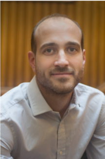
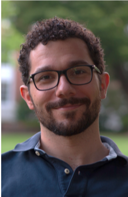
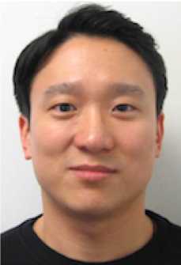
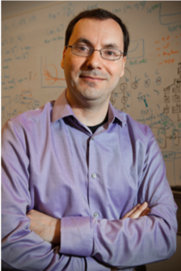
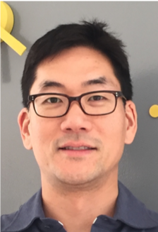

# Tutorial on Agile Research Test Chips

## Updates

 The tutorial slides are available [here](./docs/CHIPKIT_Tutorial_\(MICRO52\).pdf)

## Overview

Research test chips are the ultimate experiment to demonstrate the true value of novel computer architecture innovations. They are always very highly regarded by reviewers as the most honest evaluation of a new hardware proposal.  In addition, there is a huge pedagogical value in taping out test chips, as it offers insight on the impact of real hardware and microarchitecture details that are critical in guiding higher level architecture decisions and trade offs.  Nonetheless, despite all this, taping out test chips remains a challenge for those who are following this path for the first time.  Traditionally, research chips have been time consuming to design, fabricate and test, and often error prone - potentially requiring re-spins to fix problems.

This tutorial sets out to present a clear and straightforward template for a modern design flow for rapid, agile, and successful tape out of research test chips. We describe a front-to-back design example, drawing on many generations of test chips (shown in the illustration below) following a consistent design approach [1], [2], [3], [4], [5].  To help researchers start up their own SoC designs, the content of this tutorial is supported with the release of our **CHIPKIT** project, which provides a comprehensive set of open source resources for the design and implementation of research tapeouts. The project includes a sample SoC design which leverages this design methodology for demonstrating novel specialized hardware architectures, using the **CHIPKIT** infrastructure.

## Outline

* The value of research test chips: fabrication routes, process technologies, project planning
* Test chip architectures: CPUs, peripherals, memories, interconnects and frameworks
* Design methodologies for custom blocks: Verilog, SystemVerilog, HLS and beyond
* Physical design flow: linting, synthesis, place and route, DRC/LVS, timing closure
* Bring up and test: packaging, PCBs, clocking, testing flows

## References
[1] [P. N. Whatmough, S. K. Lee, H. Lee, S. Rama, D. Brooks and G. Wei, in IEEE International Solid-State Circuits Conference, 2017](https://ieeexplore.ieee.org/abstract/document/7870351)

[2] [P. N. Whatmough, S. K. Lee, D. Brooks and G. Wei, in IEEE Journal of Solid-State Circuits, 2018](https://ieeexplore.ieee.org/abstract/document/8387436)

[3] [S. K. Lee, P. N. Whatmough, N. Mulholland, P. Hansen, D. Brooks and G. Wei, in IEEE European Solid State Circuits Conference, 2018](https://ieeexplore.ieee.org/abstract/document/8494245)

[4] [S. K. Lee, P. N. Whatmough, D. Brooks and G. Wei, in IEEE Journal of Solid-State Circuits, 2019](https://ieeexplore.ieee.org/abstract/document/8715387)

[5] [P. N. Whatmough, S. K. Lee, M. Donato, H.-C. Hsueh, S. L. Xi, U. Gupta, L. Pentecost, G. Ko, D. Brooks and G.-Y. Wei, in Symposium on VLSI Circuits, 2019](https://ieeexplore.ieee.org/document/8778002)

# Organizers and Affiliations

 <b>Paul Whatmough, Arm Research</b>: Paul N. Whatmough received the B.Eng. degree (first class Hons.) from the University of Lancaster, in 2003, the M.Sc. degree (with distinction) from the University of Bristol, in 2004, and the Doctorate degree in electronic engineering from University College London, in 2012, all in the UK.  He currently leads research on hardware for machine learning at Arm ML Research group in Boston, MA, and is a part-time Associate at Harvard University, MA. He has taped out more than a dozen chips to date, in industrial and academic research groups.  

 <b>Marco Donato, Harvard University</b>: Marco Donato received his B.S. and M.S. (cum laude) in Electrical Engineering from the University of Rome “La Sapienza”, Italy, in 2008 and 2010, respectively, and his Ph.D. in Electrical Sciences and Computer Engineering from Brown University in 2016. In 2017, he joined Harvard University. His research interests include modeling and analysis of noise sources in nanoscale circuits, and automated tools for noise-tolerant circuit architectures. He is currently working on the design of novel embedded memory subsystems and circuitry in advanced CMOS technology nodes with applications to machine learning hardware accelerator SoCs.

 <b>Glenn G. Ko, Harvard University</b>: Glenn G. Ko is a postdoctoral researcher at Harvard University working with Professor Gu-Yeon Wei and Professor David Brooks. He received B.S. and M.S. in Electrical and Computer Engineering, from the University of Illinois at Urbana-Champaign in 2004 and 2006 respectively. He then joined Samsung Electronics where he designed Samsung Exynos application processor SoCs. He returned to Illinois and received Ph.D. in Electrical and Computer Engineering in 2017 before joining Harvard University in 2018. He has also spent summers at Qualcomm Research and IBM Research on machine learning and architecture research. His current research interests are machine learning, algorithm-hardware co-design and scalable accelerator architectures on the cloud and edge devices.

 <b>David Brooks, Harvard University</b>: David Brooks is the Haley Family Professor of Computer Science in the School of Engineering and Applied Sciences at Harvard University. Prior to joining Harvard, he was a research staff member at IBM T.J. Watson Research Center. Prof. Brooks received his BS in Electrical Engineering at the University of Southern California and MA and PhD degrees in Electrical Engineering at Princeton University. His research interests include resilient and power-efficient computer hardware and software design for high-performance and embedded systems. Prof. Brooks is a Fellow of the IEEE and has received several honors and awards including the ACM Maurice Wilkes Award and ISCA Influential Paper Award.

 <b>Gu-Yeon Wei, Harvard University</b>: Gu-Yeon Wei is Robert and Suzanne Case Professor of Electrical Engineering and Computer Science in the Paulson School of Engineering and Applied Sciences (SEAS) at Harvard University. He received his BS, MS, and PhD degrees in Electrical Engineering from Stanford University. His research interests span multiple layers of a computing system: mixed-signal integrated circuits, computer architecture, and design tools for efficient hardware. His research efforts focus on identifying synergistic opportunities across these layers to develop energy-efficient solutions for a broad range of systems from flapping-wing microrobots to machine learning hardware for IoT devices to large-scale servers.

